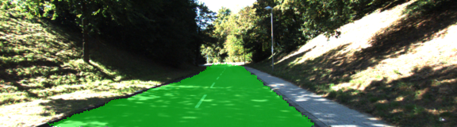

# Semantic Segmentation
### Introduction
In this project, you'll label the pixels of a road in images using a Fully Convolutional Network (FCN).

### Setup
##### GPU
`main.py` will check to make sure you are using GPU - if you don't have a GPU on your system, you can use AWS or another cloud computing platform.
##### Frameworks and Packages
Make sure you have the following is installed:
 - [Python 3](https://www.python.org/)
 - [TensorFlow](https://www.tensorflow.org/)
 - [NumPy](http://www.numpy.org/)
 - [SciPy](https://www.scipy.org/)

You may also need [Python Image Library (PIL)](https://pillow.readthedocs.io/) for SciPy's `imresize` function.

##### Dataset
Download the [Kitti Road dataset](http://www.cvlibs.net/datasets/kitti/eval_road.php) from [here](http://www.cvlibs.net/download.php?file=data_road.zip).  Extract the dataset in the `data` folder.  This will create the folder `data_road` with all the training a test images.

##### Run
Run the following command to run the project:
```
python main.py
```
**Note:** If running this in Jupyter Notebook system messages, such as those regarding test status, may appear in the terminal rather than the notebook.

#### Implementation

For semantic segmentation I used the FCN-8 architecture.
The pretrained model is the `VGG16` model, without last fully connected layer.
The implementation is in the function in the file `main.py`
```python
def layers(vgg_layer3_out, vgg_layer4_out, vgg_layer7_out, num_classes):
```
Where three layers from the VGG16 models are used:
1. I apply 1-by-1 convolution on all three layers with the kernel size and strides 1
2. The 1-by-1 convolution of 7-th layer is upsampled
3. A skip connection layer is added, which is a mix of upsampled 7th layer and a convolution of the 
 4th layer
4. A skip connection layer is upsampled with `kernel_size=4, strides=2`
5. The previous layer and the convolution of the 3rd layer are connected into a skip connection layer
6. The previous layer is upsampled with `kernel_size=16, strides=8`

Upscaling the 4th and thr 3rd layer didn't bring any loss performance improvement, so
it was not made in the final version.
For every layer a regularizer was added, and all regularization losses were added to a cross_entropy loss.

Here are the parameters I've chosen:
* standard deviation for kernel initializer  0.01
* scale for tf.contrib.layers.l2_regularizer 1e-3
* epochs = 20
* batch_size = 8
* keep probability 0.5 
* learning rate 0.0001


Her are examples of the saved images after running the model:

 


